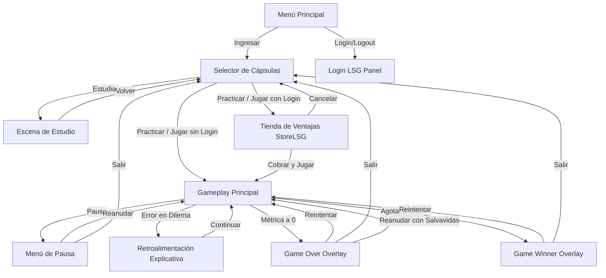

# Documento de Diseño de Videojuego (Game Design Document - GDD)


## **CYBERSWIPE-V2**
### *“El factor humano es tu primera línea de defensa”*

---

**Información del Proyecto e Historial**
- **Videojuego Serio**: CyberSwipe-v2 (Juego Serio de Concienciación en Ciberseguridad para PYMEs)
- **Contexto Académico**: Trabajo de Título para optar al título de Ingeniero Civil en Informática
- **Autor**: Bastian Guerrero A.
- **Profesor Guía**: Roberto González I.
- **Profesores Co-Guías**: Juan Iturbe, Joaquín Macías
- **Institución**: Universidad de Santiago de Chile (USACH), Facultad de Ingeniería, Departamento de Ingeniería Informática, Laboratorio InTeractiOn
- **Fecha de Publicación**: Junio 2026
- **Versión del Documento**: 2.0 (GDD Definitivo)
- **Copyright**: © Laboratorio InTeractiOn, USACH, 2026. Todos los derechos reservados.

---

## **Control de Versiones del Documento**

| Versión | Fecha | Autor | Descripción de Cambios |
| :--- | :--- | :--- | :--- |
| **1.0** | 19 Ene 2026 | Bastian Guerrero A. | Versión conceptual inicial como parte de la propuesta de tesis. |
| **1.1** | 15 Mar 2026 | Bastian Guerrero A. | Integración del diseño preliminar de las cápsulas y el framework LSG. |
| **2.0** | 26 Jun 2026 | Bastian Guerrero A. | Redacción definitiva tras la implementación en Godot 4.5, detallando mecánicas de swipe, HUD, tienda de ventajas modulares (StoreLSG), reanimaciones y telemetría real. |

---

## **Índice General**

1. [Sección I: Objetivos del Juego y Visión General](#sección-i-objetivos-del-juego-y-visión-general)
2. [Sección II: Descripción General de la Historia y Narrativa](#sección-ii-descripción-general-de-la-historia-y-narrativa)
3. [Sección III: Controles y Esquema de Interacción](#sección-iii-controles-y-esquema-de-interacción)
4. [Sección IV: Requerimientos Tecnológicos e Infraestructura](#sección-iv-requerimientos-tecnológicos-e-infraestructura)
5. [Sección V: Interfaz de Usuario, HUD y Flujo de Pantallas](#sección-v-interfaz-de-usuario-hud-y-flujo-de-pantallas)
6. [Sección VI: Mecánicas de Juego Detalladas y Gamificación LSG](#sección-vi-mecánicas-de-juego-detalladas-y-gamificación-lsg)
7. [Sección VII: Diseño de Niveles y Estructura Instruccional](#sección-vii-diseño-de-niveles-y-estructura-instruccional)
8. [Sección VIII: Integración con la API de Red y Telemetría Académica](#sección-viii-integración-con-la-api-de-red-y-telemetría-académica)
9. [Sección IX: Despliegue, Mantenimiento y Guía de Desarrollo](#sección-ix-despliegue-mantenimiento-y-guía-de-desarrollo)

---

## **Sección I: Objetivos del Juego y Visión General**

### 1.1. High Concept (Gran Concepto)
**CyberSwipe-v2** es un videojuego serio móvil de toma de decisiones rápidas de la categoría **Puzzle** que emplea mecánicas de deslizamiento horizontal (*Swipe*) para entrenar a colaboradores de PYMEs chilenas en el reconocimiento y prevención de incidentes de ciberseguridad cotidianos, vinculando su desempeño lúdico con hábitos del mundo real a través del framework **LifeSync-Games (LSG)**.

### 1.2. Características Clave ("Back of the Box")
* **Decisiones de Ciberseguridad en Segundos**: Lee dilemas de seguridad informática basados en escenarios de oficina cotidianos y toma decisiones inmediatas deslizando la tarjeta a la izquierda o a la derecha.
* **El Balance de la PYME (Tríada CID)**: Mantén a salvo los recursos vitales de tu empresa: *Confidencialidad*, *Integridad* y *Disponibilidad* de los datos sin agotar el *Presupuesto*. Una sola métrica en cero y tu empresa sufrirá una quiebra o una brecha de seguridad irreversible.
* **Retroalimentación Formativa Activa**: Olvídate de las charlas aburridas. Si tomas una mala decisión, el juego pausa el flujo para entregarte una explicación pedagógica concisa de por qué esa acción fue perjudicial y cómo actuar en la vida real.
* **Tienda de Ventajas Híbrida (LSG)**: Conéctate con la plataforma de la USACH para canjear los puntos que has obtenido por tus hábitos cotidianos y salud en la vida real por potenciadores que mitigan daños en la partida o te otorgan vidas adicionales.
* **Niveles Dinámicos y Flexibles**: Todo el contenido educativo y las cartas están estructurados en un formato dinámico JSON independiente, lo que permite a administradores y docentes actualizar o añadir nuevos temas en segundos sin alterar el código base del juego.

### 1.3. Objetivos Pedagógicos y Concienciación
El factor humano representa el vector de origen en más del 90% de los incidentes de ciberseguridad a nivel organizacional (ransomware, phishing, robo de credenciales). El objetivo pedagógico primario del juego es desarrollar en colaboradores no técnicos la **conciencia situacional** y la habilidad para identificar de forma proactiva amenazas de seguridad de la información.

### 1.4. Justificación y Contexto Normativo (Ley 21.719 - Chile)
En el contexto nacional chileno, la promulgación de la **Ley 21.719** establece responsabilidades administrativas y civiles estrictas para las empresas respecto a la seguridad de la información y la protección de datos personales:
* **Artículo 50 (Formación Permanente)**: Determina que la capacitación periódica y concienciación del personal es una función organizativa obligatoria para garantizar el debido cuidado de los datos.
* **Artículo 14 quinquies 2 (Medidas Organizativas)**: Exige la adopción de medidas técnicas y organizativas para mitigar riesgos, incluyendo la formación de los empleados.
* **Artículo 35 (Sanciones)**: El incumplimiento de estas obligaciones formativas puede catalogarse como infracción grave, conllevando multas severas de hasta **10.000 UTM** (Unidades Tributarias Mensuales).

*CyberSwipe-v2* se justifica como una herramienta interactiva, accesible y de bajo costo que ayuda de forma medible a las PYMEs chilenas a cumplir con las exigencias de capacitación de la ley, minimizando las tasas de error de los empleados ante correos fraudulentos, fugas de contraseñas y otros vectores de ataque.

### 1.5. Público Objetivo
Colaboradores y empleados de Pequeñas y Medianas Empresas (PYMEs) en Chile. Este perfil de usuario se caracteriza por no poseer formación técnica avanzada en informática, disponer de tiempos muy acotados para procesos de capacitación formal en el horario laboral y preferir interacciones simples basadas en dispositivos móviles personales o corporativos.

---

## **Sección II: Descripción General de la Historia y Narrativa**

### 2.1. Contexto Narrativo
En *CyberSwipe-v2*, no existe una narrativa lineal rígida ni fantasiosa. En su lugar, se implementa una **narrativa situacional y episódica**. El jugador asume el rol del encargado operativo o colaborador clave en una PYME chilena en crecimiento (por ejemplo, una empresa de facturación, una oficina de corretaje de propiedades o una distribuidora). 

A lo largo de su jornada laboral simulada, el jugador recibe notificaciones, correos electrónicos, llamadas de socios, consultas de practicantes o situaciones físicas en la oficina. Cada carta representa un dilema realista del día a día de su puesto.

### 2.2. Estructura de la Jornada
El flujo de la historia se divide en **Cápsulas de Aprendizaje** (Etapas de un día de trabajo). 
1. **Inicio de Etapa**: El juego introduce la temática de estudio (ej. *"Hoy instalaremos el nuevo servidor y se integrarán nuevos practicantes"*, estableciendo la temática de bloqueo de pantalla y gestión de credenciales).
2. **Navegación Narrativa**: El jugador avanza resolviendo dilemas consecutivamente. Las cartas le plantean opciones de acción rápidas bajo la premisa de mantener a flote las métricas operacionales de la empresa.
3. **El Desenlace de la Ronda**:
   - **Final Exitoso (Victoria)**: Al superar todos los dilemas de una cápsula, la PYME sobrevive a la jornada sin incidentes mayores. Se despliega una medalla de logro y un resumen formativo de las buenas prácticas dominadas.
   - **Final de Incidente (Derrota)**: Si un recurso crítico se agota, se simula una brecha de seguridad realista (quiebra por secuestro de datos ransomware, multa del ente regulador por fuga de datos de clientes, caída de servidores por negligencia). El juego entrega retroalimentación pedagógica y permite al usuario aprender de la falla o pagar por un rescate en base a su perfil LSG.

---

## **Sección III: Controles y Esquema de Interacción**

El sistema de controles está optimizado para dispositivos móviles utilizando interacciones táctiles directas de un solo dedo, facilitando la jugabilidad casual y de una sola mano.

### 3.1. Controles en Partida (Mecánica de Swipe)
La interacción principal gira en torno a la manipulación física de la carta de dilema en pantalla:
* **Arrastrar (Drag / Toque sostenido)**: El jugador presiona sobre la carta y desliza el dedo de forma horizontal (izquierda o derecha). El movimiento vertical está bloqueado por código para garantizar precisión y concentración.
* **Previsualización Sostenida**: Al arrastrar la carta hacia un lado sin soltarla, se despliega una superposición visual en la carta indicando la decisión propuesta (ej. *"Bloquear PC"* o *"Dejarla abierta"*). Simultáneamente, el HUD activa animaciones de previsualización en los recursos asociados, anticipando si estos subirán o bajarán.
* **Soltar (Swipe validado)**: Si el jugador desliza la carta superando un umbral de **200 píxeles** desde el centro y la suelta, la carta sale disparada fuera de la pantalla en esa dirección, consolidando la decisión.
* **Regreso (Swipe cancelado)**: Si el jugador desliza la carta pero la suelta antes de superar el umbral de 200 píxeles, la carta regresa automáticamente a su posición central con una animación suavizada de amortiguación, cancelando cualquier previsualización.

### 3.2. Controles Auxiliares y Menús
* **Clic / Toque simple**: Navegación por botones del Menú Principal, Selección de Cápsulas, Botón de Pausa, Tienda de Ventajas y botón de Continuar en la retroalimentación de errores.
* **Fallback para PC**: En caso de ejecutarse en navegadores web o aplicaciones de escritorio, los toques táctiles son reemplazados de forma idéntica por interacciones de arrastre con el botón izquierdo del mouse.

---

## **Sección IV: Requerimientos Tecnológicos e Infraestructura**

El juego ha sido diseñado bajo una estricta optimización técnica para garantizar su ejecución fluida en una amplia gama de dispositivos Android (desde gama baja hasta alta) y facilitar la recolección académica de datos.

### 4.1. Tecnologías Core y Motor de Desarrollo
* **Motor**: **Godot Engine 4.5** (GL Compatibility). El backend gráfico está basado en OpenGL ES 2.0 / 3.0, lo que garantiza el menor uso de batería, una rápida carga de recursos y compatibilidad absoluta con procesadores móviles antiguos sin comprometer el rendimiento en FPS.
* **Lenguaje de Scripting**: GDScript.

### 4.2. Almacenamiento y Persistencia de Datos
* **Nativo Offline**: Para escenarios donde el colaborador juegue sin conectividad, el progreso se almacena localmente en la memoria del dispositivo utilizando un recurso personalizado serializado en la ruta `user://progreso_usuario.tres` (clase `ProgresoUsuario`). Este archivo almacena el nombre del jugador, el récord de puntos acumulados, el nivel máximo desbloqueado y los mejores puntajes de cada cápsula.

### 4.3. Integración de Red (Ecosistema API de la USACH)
El juego se conecta a través de protocolos seguros HTTPS con los servidores centrales desplegados en el Departamento de Ingeniería Informática (DIINF) de la Universidad de Santiago de Chile:
* **Autenticación**: Endpoints expuestos en `https://lsg.diinf.usach.cl/lsg-auth` para inicio de sesión, obtención de perfiles académicos y roles del alumno.
* **Núcleo de Mecánicas y Tienda**: API disponible en `https://lsg.diinf.usach.cl/lsg-core-api` para consultar balances de puntos por dimensión del estudiante, registrar la adquisición de ventajas en tiempo real y cerrar sesiones globales.
* **Base de Datos de Telemetría**: Endpoint de recolección de logs en `/game-logs/sessions`, donde se almacenan cronológicamente las partidas y los comportamientos de los jugadores para análisis de usabilidad e investigación académica.

### 4.4. Auxiliares de Desarrollo y Cheats (Directriz de Scott Rogers)
Para facilitar las pruebas técnicas de software, la evaluación de usabilidad (SUS) con usuarios reales y la depuración del balance de recursos, el juego incorpora mecánicas auxiliares de desarrollo (*cheats*):
* **Sistema de Reanimación (Salvavidas)**: Integrado directamente en el ciclo de juego. Permite revivir al jugador en su primera derrota de la ronda pagando puntos afectivos en la API, actuando como un bypass controlado de fin de juego.
* **Simulación de Puntos en Servidor**: En modo de desarrollo, el juego permite inyectar saldos virtuales a través de cuentas de prueba académicas para testear la adquisición de ventajas en la tienda sin necesidad de haber realizado actividades físicas reales previas.
* **Omitir Nivel (Level Skip)**: El selector de cápsulas evalúa el estado guardado en el archivo `.tres`. Para pruebas rápidas de QA, los desarrolladores pueden editar el valor `progreso_general` directamente en el archivo local para desbloquear todas las etapas instantáneamente.

---

## **Sección V: Interfaz de Usuario, HUD y Flujo de Pantallas**

La interfaz de usuario adopta un estilo visual moderno de temática ciberpunk con colores vibrantes neón y elementos semi-transparentes (*glassmorphism*), lo que genera una estética premium y atractiva para el usuario final.

### 5.1. Flujo de Navegación de Pantallas



### 5.2. Componentes del HUD de Partida
El HUD en la parte superior de la escena de juego muestra de forma limpia el estado operativo de la PYME:
1. **Presupuesto (Icono de Moneda / Color Naranja)**: Representa los fondos económicos.
2. **Confidencialidad (Icono de Candado / Color Azul)**: Representa la seguridad contra accesos no autorizados.
3. **Integridad (Icono de Escudo / Color Verde)**: Representa la confiabilidad y alteración de los datos.
4. **Disponibilidad (Icono de Rayo / Color Magenta)**: Representa la operatividad continua de los sistemas.
5. **Marcador de Puntos (Contador de Score)**: Ubicado en la parte superior central. Muestra la cantidad de decisiones correctas tomadas consecutivamente en la ronda.
6. **Botón de Pausa**: Esquina superior derecha. Congela el árbol de escenas y abre las opciones de salida.
7. **Botón de Perfil/Login**: Esquina superior izquierda. Muestra la medalla del perfil multidimensional si hay sesión activa, o invita a iniciar sesión si se juega como invitado.

### 5.3. Sistema de Previsualización de Impacto en Recursos
Una de las innovaciones en la interfaz de usuario de *CyberSwipe-v2* es el comportamiento predictivo del HUD ante el arrastre de las cartas:
* Cuando el jugador arrastra la carta hacia la izquierda o derecha (estableciendo una intención de decisión mayor al 5% del recorrido), el script principal calcula la dirección de cambio definida en la carta para cada recurso.
* Si el recurso va a disminuir, el HUD muestra una **flecha roja hacia abajo** parpadeante al lado del icono del recurso.
* Si el recurso va a aumentar, muestra una **flecha verde hacia arriba** parpadeante.
* Si el recurso se mantiene neutral, no se muestra ningún indicador.
* Si la ventaja de *Análisis de Impacto* está activa, los indicadores muestran el **número exacto de cambio** (ej: `-25` o `+10`) sobre la barra de progreso, eliminando la incertidumbre en la toma de decisiones.

---

## **Sección VI: Mecánicas de Juego Detalladas y Gamificación LSG**

### 6.1. Reglas y Estado del Sistema
La partida se rige por un sistema dinámico de simulación de recursos en un rango continuo de **[0, 100]**:
* El jugador inicia la ronda con **50 puntos** en las cuatro métricas (Presupuesto, Confidencialidad, Integridad y Disponibilidad).
* Cada carta de dilema posee dos diccionarios de efectos numéricos: `efecto_izquierda` y `efecto_derecha`.
* Al validar una dirección, los valores de los efectos correspondientes se suman o restan a los recursos de la partida, limitando el rango con un operando `clamp` entre 0 y 100.
* **Condición de Derrota**: Si en cualquier instante, tras aplicar un efecto o resolver un dilema, alguna de las cuatro métricas cae a **0 o menos**, el juego se detiene inmediatamente.
* **Condición de Victoria**: El jugador gana la partida si logra procesar con éxito y mantener con vida los recursos de la empresa a lo largo de toda la pila de cartas de la cápsula (el número de cartas varía entre 10 y 15 según la cápsula).

### 6.2. El Ecosistema de Puntos Multidimensionales (LSG)
A diferencia de los juegos tradicionales con economías cerradas, *CyberSwipe-v2* implementa un modelo de gamificación híbrido que conecta el comportamiento del jugador en su vida cotidiana con el juego. El framework **LifeSync-Games (LSG)** vincula el desempeño lúdico con hábitos físicos, mentales, sociales y afectivos mediante sensores lógicos y físicos. 

Los puntos se acumulan en el libro mayor de la API de la USACH en cuatro dimensiones clave del estudiante:
* **Dimensión Mental**: Representa hábitos de estudio, concentración y lectura académica.
* **Dimensión Afectiva**: Vinculada al bienestar psicológico, pausas de descanso y resiliencia emocional.
* **Dimensión Social**: Relacionada con el trabajo en equipo, participación en foros estudiantiles y colaboración física.
* **Dimensión Física**: Asociada al movimiento físico, pasos diarios registrados por el giroscopio/podómetro del teléfono y hábitos saludables.

### 6.3. Tienda de Ventajas Pre-Partida (StoreLSG)
Antes de iniciar una cápsula disponible, si el usuario cuenta con una sesión académica activa de LSG, se despliega la interfaz de la tienda. El jugador puede canjear sus puntos de la vida real por ventajas temporales exclusivas para la ronda que iniciará:

1. **Consultoría Preventiva** (ID 45 | Gasta **25 puntos de Dimensión Mental**):
   - *Efecto*: Modifica el estado inicial de la partida. Las cuatro métricas de recursos comienzan la ronda en **60 puntos** en lugar de los 50 base, otorgando un margen de supervivencia del 20% adicional.
2. **Análisis de Impacto** (ID 46 | Gasta **40 puntos de Dimensión Afectiva**):
   - *Efecto*: Habilita la revelación matemática predictiva. Durante el arrastre de la carta, los indicadores del HUD muestran en tiempo real el valor numérico exacto de ganancia o pérdida (ej: `-30` o `+10`) sobre cada recurso, permitiendo al colaborador evaluar con precisión la relación costo-beneficio de su decisión.
3. **Subsidio de Seguridad** (ID 47 | Gasta **30 puntos de Dimensión Social**):
   - *Efecto*: Mitigación económica en decisiones correctas. Si el jugador toma la decisión acertada pero esta conlleva un gasto operativo (pérdida en el recurso de Presupuesto), el daño financiero se reduce en un **20%** (se calcula mediante `impacto * 0.8` redondeado al entero más cercano).
4. **Ciberseguro Activo** (ID 48 | Gasta **35 puntos de Dimensión Física**):
   - *Efecto*: Cobertura ante incidentes de ciberseguridad. Reduce a la mitad (**50% de mitigación**) todas las pérdidas numéricas que sufran los recursos de **Integridad** y **Disponibilidad** a lo largo de la ronda por malas decisiones, simulando una póliza de seguro empresarial.

### 6.4. Mecánica de Reanimación (Salvavidas)
Si el jugador agota un recurso durante la partida (derrota), el overlay de Game Over le ofrece la opción de adquirir un seguro de reanimación en caliente:
* **Salvavidas** (ID 44 | Gasta **50 puntos de Dimensión Afectiva**):
  - Al presionar el botón, el juego realiza una transacción POST en tiempo real hacia la API de LSG. 
  - Si el backend confirma saldo suficiente y aprueba el canje, el script del juego invoca el método `revivir_jugador()`.
  - Esta función restaura el recurso que causó la derrota a un nivel seguro de **50 puntos**, limpia el estado de fallo y destruye la pantalla de Game Over, reanudando la partida exactamente en la misma carta de dilema sin perder el score ni las ventajas de la ronda.

---

## **Sección VII: Diseño de Niveles y Estructura Instruccional**

### 7.1. Estructura de Contenido Dinámico (JSON)
Con el fin de garantizar la escalabilidad y permitir que el juego sea mantenido en el tiempo por personal docente o administradores de seguridad sin conocimientos de programación, todo el diseño de niveles está desacoplado del motor gráfico. 

El archivo de configuración principal es [capsulas.json](file:///d:/ProyectosGodot/cyber-swipe/capsulas.json). El motor de Godot analiza este archivo dinámicamente al iniciar, poblando la interfaz de selección y la baraja de cartas del `CardManager`.

Cada objeto Cápsula del archivo JSON sigue la siguiente estructura de datos exacta:
* `id` (int): Identificador correlativo del nivel.
* `titulo` (String): Título descriptivo de la lección académica.
* `subtitulo` (String): Breve bajada explicativa de la temática.
* `mini_descripcion` (String): Resumen de los aprendizajes esperados (desplegado en el acordeón del menú de selección).
* `contenido_estudio` (String): Texto educativo formateado en BBCode para su lectura en la fase previa a la partida.
* `estado` (String): Estado inicial por defecto (ej. "Disponible").
* `cartas` (Array): Lista de dilemas interactivos asociados a la cápsula, donde cada carta contiene:
  - `imagen` (int): Índice de la textura que representa gráficamente la carta.
  - `contexto` (String): Descripción textual detallada del dilema organizacional.
  - `texto_izquierda` (String): Etiqueta para la decisión al deslizar a la izquierda.
  - `texto_derecha` (String): Etiqueta para la decisión al deslizar a la derecha.
  - `correcto` (float): Dirección correcta de decisión (`-1.0` para izquierda, `1.0` para derecha).
  - `explicacion` (String): Texto formativo que explica detalladamente por qué la decisión correcta mitiga el riesgo y la incorrecta lo agrava.
  - `efecto_izquierda` (Dictionary): Impacto numérico en los cuatro recursos (`presupuesto`, `confidencialidad`, `integridad`, `disponibilidad`) si se toma la decisión izquierda.
  - `efecto_derecha` (Dictionary): Impacto numérico en los recursos si se toma la decisión derecha.

### 7.2. Contenido Instruccional de las 5 Cápsulas del Juego

El juego cubre cinco áreas críticas de la formación y concienciación en ciberseguridad adaptadas al contexto operativo diario de una PYME chilena:

---

### **Cápsula 1: Bloqueo de Pantalla y Credenciales**
* **Objetivos de Aprendizaje**: Comprender la importancia del bloqueo automático de dispositivos, el uso de contraseñas robustas y la protección física de accesos a servidores y plataformas financieras.
* **Conceptos Clave de Estudio**:
  - *PIN de 6 dígitos*: Eleva las combinaciones posibles de 10,000 (en 4 dígitos) a 1,000,000, dificultando la adivinación física de claves.
  - *Autenticación Multifactor (MFA)*: Capa de seguridad adicional que previene el secuestro de cuentas en más del 99% de los casos.
  - *Principio de Privacidad Física*: Prohibición de dejar sesiones administrativas abiertas al ausentarse del puesto de trabajo o delegar contraseñas mediante post-its físicos en la oficina.
* **Dilemas de Ejemplo (Cartas)**:
  - *Caso 1*: Un compañero te pide el teléfono desbloqueado para hacer una llamada rápida y sale de la oficina con él. (Decisión correcta: Pedir que lo devuelva | *Confidencialidad* e *Integridad* se ven gravemente afectadas si se confía).
  - *Caso 2*: Un practicante sugiere anotar la clave de administración en un post-it pegado bajo el teclado. (Decisión correcta: Prohibir post-its | Afecta negativamente a la *Confidencialidad*).
  - *Caso 3*: El navegador corporativo ofrece recordar y autocompletar todas las claves del banco de la empresa en una computadora compartida. (Decisión correcta: No guardar contraseñas | Evita pérdidas de *Confidencialidad* e *Integridad* ante infecciones de malware).

---

### **Cápsula 2: Phishing y Correos Falsos**
* **Objetivos de Aprendizaje**: Aprender a reconocer correos fraudulentos, enlaces maliciosos, suplantaciones de identidad de entes reguladores y fraudes mediante mensajería instantánea.
* **Conceptos Clave de Estudio**:
  - *Remitentes Sospechosos*: Direcciones que afirman ser oficiales pero usan dominios genéricos o alterados de forma sutil.
  - *Urgencia Artificial*: Táctica de ingeniería social que exige acciones inmediatas (multas, bloqueos, multas tributarias) bajo amenaza para anular el juicio crítico del colaborador.
  - *Archivos Adjuntos Peligrosos*: Archivos ejecutables, PDFs o archivos ZIP con nombres genéricos que contienen troyanos o malware espía.
* **Dilemas de Ejemplo (Cartas)**:
  - *Caso 1*: Llega un correo urgente del SII advirtiendo de diferencias tributarias graves y exige descargar un archivo PDF adjunto para ver la citación. (Decisión correcta: Borrar correo | Descargar el PDF gatilla malware de tipo troyano, destruyendo *Integridad* y *Disponibilidad* y consumiendo *Presupuesto* en remediación).
  - *Caso 2*: Recibes un WhatsApp de un número desconocido con la foto de tu contador que te pide transferir de urgencia sus honorarios debido a problemas bancarios. (Decisión correcta: Llamar al número antiguo verificado | Previene fraudes financieros directos).

---

### **Cápsula 3: Copias de Seguridad (Backup)**
* **Objetivos de Aprendizaje**: Dominar las directrices de respaldo de información crítica y comprender las consecuencias y formas de mitigar ataques de Ransomware (secuestro de datos).
* **Conceptos Clave de Estudio**:
  - *Regla de Respaldo 3-2-1*: Mantener 3 copias de seguridad de tus datos, almacenadas en 2 tipos de soportes diferentes, con 1 de las copias guardada fuera de línea (offline/nube externa).
  - *Mitigación de Ransomware*: Los ataques cifran los archivos locales. Si la empresa no posee copias offline desconectadas de la red, los atacantes pueden cifrar también los respaldos conectados.
* **Dilemas de Ejemplo (Cartas)**:
  - *Caso 1*: Tu socio propone configurar respaldos automáticos en un disco duro externo que permanece conectado físicamente las 24 horas al servidor principal para mayor comodidad. (Decisión correcta: Configurar respaldos offline desconectados | Dejar el respaldo conectado expone los respaldos a ser cifrados en un ataque de Ransomware, destruyendo la *Disponibilidad* y obligando a pagar rescates).

---

### **Cápsula 4: Seguridad en Redes y Conexiones**
* **Objetivos de Aprendizaje**: Identificar la importancia de asegurar los entornos de comunicación digital, el uso correcto de redes privadas y los riesgos de utilizar redes Wi-Fi públicas.
* **Conceptos Clave de Estudio**:
  - *Segmentación de Redes*: Mantener redes Wi-Fi independientes para visitas y clientes, separadas de la red administrativa donde se procesan datos financieros y de servidores.
  - *Red Privada Virtual (VPN)*: Encripta la comunicación cuando se realiza teletrabajo o se accede a recursos de la PYME desde conexiones externas.
* **Dilemas de Ejemplo (Cartas)**:
  - *Caso 1*: Trabajas desde una cafetería pública y debes ingresar al portal bancario de la PYME para pagar sueldos. El Wi-Fi de la cafetería no requiere contraseña. (Decisión correcta: Usar datos móviles o VPN activa | Evita ataques de intermediario *Man-in-the-Middle* que capturan credenciales bancarias).

---

### **Cápsula 5: Ingeniería Social Física**
* **Objetivos de Aprendizaje**: Reconocer trampas presenciales de manipulación que buscan evadir los controles tecnológicos introduciéndose físicamente en la organización.
* **Conceptos Clave de Estudio**:
  - *Baiting (Cebo)*: Técnica donde el atacante deja dispositivos de almacenamiento (pendrives USB, tarjetas SD) infectados en áreas comunes esperando que un empleado los conecte a la red por curiosidad.
  - *Tailgating (Colarse)*: El atacante aprovecha que un empleado autorizado abre una puerta restringida para pasar detrás de él sin identificarse.
  - *Vishing*: Suplantación de identidad telefónica que simula soporte técnico o fiscalizadores públicos para obtener datos confidenciales.
* **Dilemas de Ejemplo (Cartas)**:
  - *Caso 1*: El encargado de bodega encuentra un pendrive USB de aspecto corporativo tirado en el estacionamiento y te lo entrega para que verifiques de quién es conectándolo a tu computador de trabajo. (Decisión correcta: Entregar a TI / Botarlo | Conectar el USB desconocido puede ejecutar malware espía directamente en el sistema, comprometiendo la *Confidencialidad* y la *Integridad*).

---

## **Sección VIII: Integración con la API de Red y Telemetría Académica**

El juego actúa como un recolector activo de datos de comportamiento lúdico e instruccional, comunicándose asíncronamente con el backend de la USACH para registrar el progreso del estudiante.

### 8.1. Flujo de Comunicación Operativa de Red
* **Inicio de Sesión**: Cuando el usuario se autentica mediante `login_lsg.gd`, el cliente envía una petición POST a la API `/login`. Si es exitosa, obtiene un JWT que se almacena localmente en memoria (`LsgAuth.access_token`).
* **Inicio de Sesión de Telemetría**: Inmediatamente tras el login exitoso, el script `ApiCore.gd` realiza una petición POST al endpoint `/sessions` registrando el inicio de la sesión global de juego e inicializando la telemetría a través del script `LsgLogger.gd` con la función `start_session()`.
* **Registro de Transacciones en Tienda**: Cada canje exitoso de ventajas en la tienda pre-partida o reanimaciones (Salvavidas) gatilla una llamada POST `/redeem` detallando el identificador de la mecánica, el coste numérico y la dimensión afectada. Si el servidor responde HTTP 200/201, se habilita la variable de la ventaja en el cliente y se registra en el log local.
* **Envío de Telemetría al Salir**: Para evitar pérdidas de información, `ApiCore.gd` intercepta el evento de cierre del sistema operativo. Mediante una llamada asíncrona controlada por `await`, envía el objeto JSON consolidado del log de eventos al endpoint `/game-logs/sessions` y cierra la sesión en el backend antes de finalizar el proceso en el dispositivo.

### 8.2. Esquema de Datos del Log de Telemetría
El payload JSON enviado al servidor de la USACH al finalizar la sesión del colaborador adopta el siguiente formato estructurado:

```json
{
  "player_id": 142,
  "videogame_id": 54,
  "session_start": "2026-06-26T18:30:12",
  "session_end": "2026-06-26T18:45:50",
  "mod_version": "2.0.0",
  "experiment_tag": "LSG_C1_T1_CV",
  "total_points_earned": 0,
  "total_points_spent": 120,
  "redemptions_count": 3,
  "raw_log": {
    "events": [
      {
        "type": "session_start",
        "timestamp": "2026-06-26T18:30:12",
        "data": {}
      },
      {
        "type": "mechanic_redeemed",
        "timestamp": "2026-06-26T18:31:05",
        "data": {
          "mechanic": "Consultoria Preventiva",
          "cost": 25,
          "dimension_id": 4
        }
      },
      {
        "type": "game_completed",
        "timestamp": "2026-06-26T18:38:22",
        "data": {
          "capsula_id": 1,
          "result": "win",
          "score_on_round": 10
        }
      },
      {
        "type": "session_end",
        "timestamp": "2026-06-26T18:45:50",
        "data": {}
      }
    ],
    "summary": {
      "total_play_time_seconds": 938,
      "total_points_earned": 0,
      "total_points_spent": 120,
      "redemptions_count": 3
    }
  }
}
```

### 8.3. Monitoreo para el Administrador
La recolección de este log estructurado permite a los investigadores académicos de la USACH y a los encargados de seguridad de la PYME:
* Evaluar la curva de aprendizaje de los colaboradores identificando qué dilemas o áreas registran mayores tasas de error (frecuencia de derrotas y reintentos).
* Monitorear el uso y efectividad de las mecánicas de gamificación del framework LSG (cuántos puntos se canjean y en qué dimensiones).
* Verificar el tiempo real dedicado a la formación y concienciación en ciberseguridad para efectos de cumplimiento regulatorio formal de la Ley 21.719.

---

## **Sección IX: Despliegue, Mantenimiento y Guía de Desarrollo**

### 9.1. Distribución y Despliegue del Videojuego
* **Plataforma Objetivo Primaria**: Dispositivos móviles con sistema operativo Android (versiones 8.0 Oreo en adelante).
* **Compilación**: Generación de paquetes Android autoejecutables (`.apk`) utilizando el sistema de exportación nativo de Godot Engine con el SDK de Android de Google y OpenJDK.
* **Instalación**: Distribución de la aplicación mediante servidores internos de la empresa o repositorios institucionales de la USACH, permitiendo descargas seguras y directas para los colaboradores.

### 9.2. Mantenimiento del Contenido Formativo
Para añadir nuevas cápsulas de estudio, corregir explicaciones pedagógicas o modificar el balance del daño en los recursos corporativos, los desarrolladores o administradores de seguridad de la información **no requieren alterar el código de Godot**. 

El mantenimiento se realiza de forma centralizada editando el archivo de texto estructurado [capsulas.json](file:///d:/ProyectosGodot/cyber-swipe/capsulas.json). Se deben seguir las siguientes reglas de mantenimiento:
1. Mantener la estructura exacta de llaves y diccionarios definidos en la Sección VII.
2. Asegurar que las referencias de imágenes para las cartas correspondan a índices válidos cargados en el arreglo del inspector en `card_manager.gd`.
3. Validar que las variables de impacto sobre los recursos (`presupuesto`, `confidencialidad`, `integridad`, `disponibilidad`) utilicen valores enteros adecuados que permitan la supervivencia lúdica (evitando restas extremas de `-100` en cartas iniciales para mantener el balance y la jugabilidad).

### 9.3. Notas y Buenas Prácticas para Futuros Desarrolladores
Si deseas expandir el sistema de software o integrar nuevas características, ten en consideración las siguientes directrices técnicas del código de *CyberSwipe-v2*:

* **Procesamiento en Estado de Pausa**: Los scripts globales de red y control de flujo ([ApiAuth.gd](file:///d:/ProyectosGodot/cyber-swipe/LSG_API/ApiAuth.gd), [ApiCore.gd](file:///d:/ProyectosGodot/cyber-swipe/LSG_API/ApiCore.gd), [LsgLogger.gd](file:///d:/ProyectosGodot/cyber-swipe/LSG_API/LsgLogger.gd), [capsula_manager.gd](file:///d:/ProyectosGodot/cyber-swipe/capsula_manager.gd) y [card_manager.gd](file:///d:/ProyectosGodot/cyber-swipe/EscenaPrincipal/card_manager.gd)) tienen configurada la propiedad `process_mode = PROCESS_MODE_ALWAYS`. Esto es crucial para garantizar que las peticiones HTTP asíncronas y el control de los menús de diálogo sigan respondiendo a los eventos del sistema operativo cuando el árbol de escenas se congela para pausar la partida física de fondo (`get_tree().paused = true`).
* **Seguridad ante Salidas Inesperadas**: El método `_notification(what)` en `ApiCore.gd` intercepta el cierre de la ventana por parte de los usuarios en móviles o PC (`NOTIFICATION_WM_CLOSE_REQUEST`). Cualquier cambio en este script debe asegurar el uso de funciones asíncronas bloqueantes (`await`) para forzar la sincronización del log de telemetría final con los servidores centrales de la USACH antes de liberar el hilo y cerrar la aplicación.
* **Duplicación de Estructuras Dinámicas**: Al extraer las cartas desde el JSON de las cápsulas en `card_manager.gd`, siempre se debe utilizar la función `.duplicate()` (ej: `cartas = cartas_dinamicas.duplicate()`). Esto crea una copia aislada en la memoria local de la partida, previniendo que las operaciones de remoción de cartas (`cartas.remove_at(indice)`) alteren o vacíen el diccionario original persistido en el Singleton `CapsulaManager` para reintentos posteriores.
